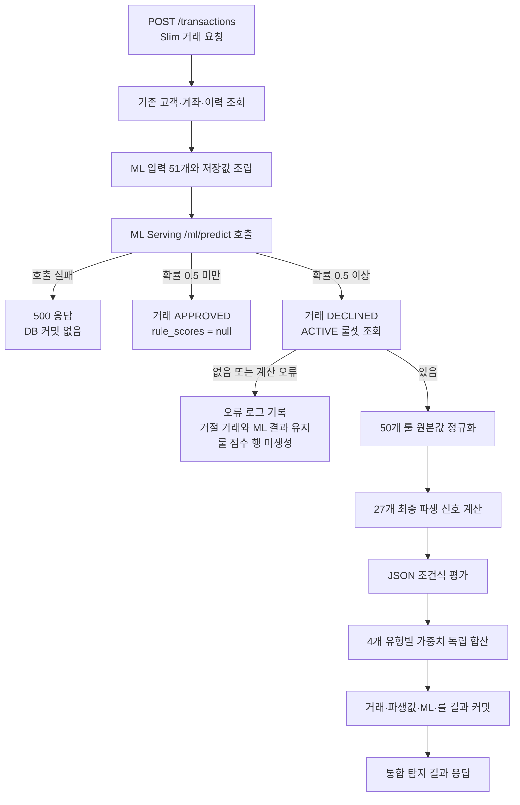

# 사기유형 룰 점수 시스템 정리

결론부터 말하면, 현재 룰 시스템은 **ML이 사기로 판정한 거래만 대상으로 DB의
활성 룰셋을 읽고, 최종 4개 사기유형 각각의 가중치 점수를 독립적으로 계산해 전부
저장·응답하는 구조**다.

룰 엔진과 거래 API는 하나의 대표 유형을 확정하지 않고 유형별 점수 전체를 넘긴다.
최소 점수나 1·2위 점수 차이도 룰 계산에는 사용하지 않는다. 다만 후속 Agent는
`type_scores`를 정렬해 기본값 `0.60`·`0.15`로 `CONFIDENT` / `AMBIGUOUS`를 판단하고,
필요하면 유사 사건 조사를 거쳐 적용 유형을 고른다. 룰 조건은 Python `if/elif`가 아니라
JSON으로 저장되므로 관리 API를 통해 룰·조건·가중치를 버전별로 변경하고 활성화할 수 있다.

코드의 현재 기본 룰셋 버전 표기는 `2026-08-13-raw60`이며 카드부정사용 유형은 없다.
`raw60`은 남아 있는 버전 라벨일 뿐, 현재 입력 개수는 아래에 설명한 ML Feature 51개다.

## 1. 전체 실행 흐름



역할은 다음처럼 분리된다.

- ML 모델: 거래의 `사기 / 정상` 이진 예측과 사기 확률 계산
- 룰 엔진: 사기 거래에 대해 유형별 조건 일치 점수 계산
- 룰 관리 API: 룰 생성·수정·Replay 비교·활성화
- DB: 룰 버전, 유형별 점수, 일치한 조건 저장
- 프론트·대시보드: 전체 점수를 정렬하고 필요한 상위 N개 표시

## 2. 거래 처리 시작점

실제 실행은 `app/api/transaction.py`의 `POST /transactions`에서 시작한다.

1. 계좌번호·거래·단말 정보로 구성된 `TransactionRequestDTO`를 받는다.
2. DB에 미리 저장된 출금계좌·수취계좌·고객과 이벤트·거래 이력을 조회한다.
3. `MLTransactionFeatures` 51개와 거래·파생 Feature 저장값을 조립한다.
4. ML Serving의 `/ml/predict`를 동기로 호출한다.
5. 확률이 `0.5` 이상이면 거래를 `DECLINED`, 미만이면 `APPROVED`로 저장한다.
6. `ml_prediction_results`에 모델 결과를 저장하고, 거절 거래만 룰 점수를 계산한다.
7. 거래·파생값·ML·룰 결과를 한 번에 커밋하고 통합 응답을 반환한다.

ML 호출이 거래 저장보다 먼저이므로 최종 호출 실패 시 거래와 결과는 커밋되지 않는다.

```text
ML 호출 실패
→ API 500 공통 오류 응답
→ transactions 행 없음
→ fraud_type_score_results 행 없음

ML 정상 판정
→ transactions.transaction_status = APPROVED
→ ml_prediction_results.predict_result = false
→ fraud_type_score_results 행 없음
→ rule_scores = null

ML 사기 판정 + 룰 점수 계산 성공
→ transactions.transaction_status = DECLINED
→ ml_prediction_results.predict_result = true
→ fraud_type_score_results에 전체 점수 저장
→ rule_scores에 전체 점수 응답
```

## 3. 입력 데이터 계약

외부 입력 DTO는 `app/dto/transaction.py`의 `TransactionRequestDTO`다. 요청에는
DB가 생성하는 `transaction_id`를 넣지 않으며, Backend가 기존 원장과 이력에서
`app/dto/ml_features.py`의 ML 입력 51개를 조립한다.

- 필수값 누락 시 `422`
- 정의하지 않은 컬럼 입력 시 `422`
- 숫자 범위와 카테고리 값 검증
- 출금·수취 계좌와 출금 계좌에 연결된 고객은 DB에 미리 존재해야 함
- Backend에서는 One-hot Encoding을 수행하지 않음
- 조립한 같은 Feature를 ML Serving과 룰 엔진에 전달

룰 엔진은 식별·민감정보를 제외한 안전한 원본 50개와 27개 파생 신호를
사용한다. 기존 ACTIVE 룰의 CamelCase 이름은 실행 전환 기간에만 내부 alias로
지원하며 신규 DRAFT는 snake_case만 허용한다.

## 4. 룰용 파생 신호

`app/services/rules/feature_builder.py`가 원본값을 검증하고 파생 신호를 계산한다.

```text
ML 입력: 51개
룰이 사용하는 원본: 50개
룰 파생 신호: 27개
최종 룰 사용 가능 Feature: 77개
```

주요 파생 신호는 다음과 같다.

```text
strong_auth_change
→ 인증정보 변경 플래그 1~4 중 3개 이상이 1

all_limit_actions
→ 한도 문의·증액·해제 3종이 모두 1

loan_related
→ Customer_loan_type이 b, c, d, e 중 하나

device_compromise_count
→ 템퍼링 + 비신뢰 인증서 + 키로깅 + 루팅·탈옥

device_compromise_2plus
→ 단말침해 신호가 2개 이상

new_or_rare_recipient
→ 과거 거래 횟수 <= 1

recipient_transfer
→ 신규·희소 수취인이면서 타인계좌 이체

rapid_repeat
→ 수취계좌 단시간 거래 횟수 >= 3

amount_anomaly
→ 거래금액 > max(월간 최대 거래금액, max(월간 표준편차, 1) × 3)

severe_amount_context
→ 금액 이상이면서 잔액 소진 또는 일 한도 압박

loan_escalation_context
→ 대출 관련이면서 번호조작·한도 3종·심각 금액 맥락 중 하나 이상

impossible_travel
→ 거리 >= 100이고 직전 거래 후 경과시간이 0시간 초과 2시간 이하

recently_resumed
→ 휴면계좌이고 거래 재개일부터 0~30일

suspension_pair / suspension_release_only / recipient_suspended_only
→ 본인계좌 정지해제와 수취계좌 거래중지의 동시·단독 상태
```

## 5. 기본 4개 룰과 점수 범위

기본 룰은 `app/services/rules/defaults.py`에 있다. 이 정의는 최초 DRAFT 룰셋을
만들 때 DB에 넣는 초기값이며, 런타임에는 DB의 ACTIVE 룰셋을 사용한다.

현재 유형은 다음 4개다.

- `VOICE_PHISHING`: 보이스피싱
- `MESSENGER_PHISHING`: 메신저피싱
- `ACCOUNT_TAKEOVER`: 계정탈취
- `FRAUD_USED_ACCOUNT`: 사기이용계좌

현재 `DEFAULT_RULE_SET`의 가중치는 다음과 같다.

| 유형 | 조건과 가중치 |
| --- | --- |
| 보이스피싱 | 번호조작 0.30, 대출 상승 맥락 0.25, 한도 3종 0.15, 심각 금액 맥락 0.15, 신규 수취인 타계좌·심각 금액 0.10, 원격제어 0.05 |
| 메신저피싱 | 원격제어 0.30, 오픈뱅킹·반복이체 0.20, 강한 인증변경·원격제어 0.20, 취약 모바일·신규 수취인 타계좌 0.15, 신규 수취인 타계좌·원격제어 0.10, 반복이체 0.05 |
| 계정탈취 | 미사용 단말·단말침해 2개 이상 0.25, 단말침해 2개 이상 0.20, 원격제어 0.15, 강한 인증변경·단말침해/원격제어 0.15, 불가능 이동 0.15, VPN/로밍·불가능 이동 0.05, 접속 실패 3회 이상 0.05 |
| 사기이용계좌 | 정지해제·수취정지 동시 충족 0.45, 정지해제만·최근재개/고액입금 0.15, 수취정지만·최근재개/고액입금 0.15, 최근재개·고액입금 0.10, 고액입금·반복이체 0.10, 반복이체 0.05 |

각 유형 내부 component 가중치의 합은 정확히 `1.0`이어야 한다. 해당 유형에서
충족한 component의 가중치만 더하므로 **각 유형의 점수 범위는 독립적으로
0~1**이다.

```text
보이스피싱 점수       0.70
메신저피싱 점수       0.60
계정탈취 점수          0.40
사기이용계좌 점수      0.80
```

유형별 점수의 합이 1을 넘어도 정상이다. 유형 전체를 합쳐 1로 정규화하지 않는다.
룰 점수는 확률도 아니다.

```text
predict_proba
→ ML이 계산한 사기 확률

rule_scores
→ 각 사기유형 조건과의 가중치 일치 점수
```

따라서 화면에는 `보이스피싱 확률 70%`가 아니라 `보이스피싱 일치 점수 70점`처럼
표현하는 것이 정확하다.

## 6. JSON 룰 조건

룰 조건은 실행 가능한 Python 문자열이 아니라 JSON으로 저장한다.

```json
{
  "field": "loan_related",
  "operator": "EQ",
  "value": true
}
```

```json
{
  "operator": "AND",
  "conditions": [
    {
      "field": "account_suspension_released",
      "operator": "EQ",
      "value": true
    },
    {
      "field": "recipient_account_suspended",
      "operator": "EQ",
      "value": true
    }
  ]
}
```

지원 연산자는 다음과 같다.

```text
AND, OR
EQ, NE
GT, GTE
LT, LTE
IN, BETWEEN
```

보안상 `eval()`이나 임의 Python·SQL 실행은 사용하지 않는다. 허용된 Feature와
연산자만 평가하며, 알 수 없는 필드·연산자·불필요한 JSON 필드는 거부한다.

## 7. 점수 계산 방식

실제 점수 엔진은 `app/services/rules/engine.py`에 있다.

```text
유형별 점수 = 해당 유형에서 충족한 component weight의 합
```

예를 들어 보이스피싱에서 세 조건만 충족했다면 다음과 같다.

```text
전화번호 조작  0.30
대출 상승 맥락 0.25
원격제어       0.05
------------------
보이스피싱 점수 0.60
```

엔진은 모든 활성 유형에 대해 이 계산을 반복하고 결과를 전부 반환한다.

```json
{
  "VOICE_PHISHING": 0.60,
  "MESSENGER_PHISHING": 0.25,
  "ACCOUNT_TAKEOVER": 0.15,
  "FRAUD_USED_ACCOUNT": 0.00
}
```

룰 엔진은 최고점 유형을 선택하거나 최소점수·점수 차이로 판정하지 않는다. 정렬과 상위 N개
선택은 소비자가 수행한다. 현재 Agent의 별도 확실성 판정 기준은 최고점 `0.60` 이상,
1·2위 차이 `0.15` 이상이며 둘 중 하나라도 부족하면 `AMBIGUOUS`다.

룰 검증 시에는 다음을 강제한다.

- 활성 유형 최소 2개
- 유형 코드 중복 금지
- 구성요소 키 중복 금지
- 가중치는 `0 초과, 1 이하`
- 각 유형의 component 가중치 합은 정확히 `1.0`

룰 엔진 자체는 새로운 유형도 enum 수정 없이 DB 룰만 추가해 계산할 수 있다. 하지만 현재
Agent 대응 정책과 표시명·가이드 코퍼스는 4개 유형을 전제로 하므로 전체 서비스에 새 유형을
추가할 때는 그 소비자 계약도 함께 확장해야 한다. 현재 관리자 API는 이 불완전한 확장을
막기 위해 기존 4개 유형의 가중치만 수정하도록 제한한다.

## 8. DB 룰 조회와 오류 처리

`app/services/rules/repository.py`는 DB 모델을 엔진의 불변 정의 객체로 변환한다.

```text
fraud_rule_sets
    ↓
fraud_rules
    ↓
fraud_rule_components
    ↓
RuleSetDefinition
    ↓
RuleEngine.score()
```

런타임에서는 가장 높은 버전의 `ACTIVE` 룰셋 하나를 사용한다. 활성 룰셋이
없거나 룰 계산이 실패하면 기본 룰을 몰래 적용하지 않는다. 오류 로그만 기록하고
점수 결과 행은 생성하지 않으며, 이미 성공한 ML 결과는 `COMPLETED`로 유지한다.

## 9. DB 테이블

### `fraud_rule_sets`

```text
id
version
status: DRAFT / ACTIVE / ARCHIVED
created_at
updated_at
activated_at
```

`minimum_score`, `ambiguity_margin`은 대표 유형 판정을 하지 않으므로 제거했다.

### `fraud_rules`

```text
id
rule_set_id
type_code
display_name
description
enabled
sort_order
created_at
updated_at
```

### `fraud_rule_components`

```text
id
rule_id
component_key
name
condition_expression JSONB
weight
sort_order
created_at
updated_at
```

### `fraud_type_score_results`

```text
id
transaction_id
rule_set_id
rule_filter_status: APPLIED / SKIPPED_NOT_FRAUD / FAILED
primary_fraud_type (nullable)
type_scores JSONB
matched_components JSONB
created_at
```

`type_scores`에는 모든 활성 유형의 점수가 들어간다. `matched_components`는 감사와
설명을 위해 유형별로 일치한 component key를 보관하지만 거래 API 응답에는 노출하지 않는다.
현재 실시간 점수 저장 경로는 `rule_filter_status = APPLIED`인 행만 만들며, 정상 거래나
룰 계산 실패에는 행을 만들지 않는다. `SKIPPED_NOT_FRAUD`와 `FAILED`는 DB CHECK에 허용된
값이지만 현재 파이프라인은 쓰지 않는다.

`primary_fraud_type` 컬럼도 현재 스키마에는 남아 있다. 실시간 룰 계산은 대표 유형을 정하지
않으므로 `NULL`로 저장하고, 시연용 완료 사건 Seed처럼 별도 입력 경로만 값을 채운다.

다음 분류 전용 값은 제거했다.

```text
status
fraud_type
top_score
second_score
score_gap
error_message
```

## 10. 거래 API 응답

`POST /transactions`, `GET /transactions`,
`GET /transactions/{transaction_id}`에서 거래·최신 ML 결과·룰 점수·확정 라벨을
하나의 `FraudDetectionResponseDTO`로 응답한다.

```json
{
  "transaction_id": 123,
  "prediction_status": "DECLINED",
  "predict_proba": 0.9959,
  "message": "이상거래 의심으로 거래가 거절되었습니다.",
  "predict_result": true,
  "rule_set_id": 1,
  "rule_scores": {
    "VOICE_PHISHING": 0.70,
    "MESSENGER_PHISHING": 0.60,
    "ACCOUNT_TAKEOVER": 0.40,
    "FRAUD_USED_ACCOUNT": 0.80
  },
  "confirmed_is_fraud": null,
  "labeled_at": null,
  "created_at": "2026-08-19T10:00:00+09:00"
}
```

승인 거래, 활성 룰셋 없음, 룰 계산 실패일 때는 `rule_scores = null`이다.
`prediction_status`는 DB 컬럼이 아니라 `transactions.transaction_status`를 API용
`COMPLETED` 또는 `DECLINED`로 바꾼 값이다. ML 호출 실패는 이 응답 DTO가 아니라
공통 오류 응답으로 반환된다.

## 11. 관리자 API

관리 API는 `X-MLOps-Admin-Token`이 필요하다.

```text
GET    /rule-features
GET    /rule-sets
GET    /rule-sets/active
GET    /rule-sets/{id}

POST   /rule-sets/drafts
DELETE /rule-sets/{id}
PUT    /rule-sets/{id}/rules/{rule_id}

POST   /rule-sets/{id}/validate
POST   /rule-sets/{id}/replay
POST   /rule-sets/{id}/activate
```

`PUT /rule-sets/{id}`는 최소점수와 모호성 기준을 제거하면서 함께 제거했다.

운영 흐름은 다음과 같다.

```text
GET /rule-sets?rule_set_status=DRAFT로 수정 중인 DRAFT 확인
→ 있으면 해당 DRAFT를 이어서 수정
→ 없으면 POST /rule-sets/drafts로 현재 ACTIVE를 복제
→ PUT으로 기존 4개 유형의 component 가중치만 수정
→ 유효성 검증
→ 최신 ML 양성 거래를 최대 1,000건 리플레이해 ACTIVE 대비 영향 확인
→ 활성화
→ 기존 ACTIVE는 ARCHIVED
→ 새 버전이 ACTIVE
→ 이후 사기 거래부터 새 룰 적용
```

동시에 여러 DRAFT를 만들 수 없다. 작업을 취소하려면
`DELETE /rule-sets/{id}`로 DRAFT 전체를 폐기한 뒤 다시 생성한다. 이 API는 DRAFT에만
허용되며 ACTIVE와 ARCHIVED는 삭제할 수 없다.

`POST /rule-sets/{id}/replay`는 DRAFT에만 허용한다. 거래별 최신 ML 예측을
먼저 확정한 뒤 그 결과가 양성인 거래를 `transaction_datetime DESC,
transaction_id DESC` 순서로 기본·최대 1,000건 선택한다. 동일한 정규화 DB
표본을 ACTIVE와 DRAFT에 각각 적용하고 결과는 응답으로만 반환한다.

```text
ML 최신 양성 거래
→ Transaction + Customer + 출금·수취 Account + DerivedFeatures 일괄 조회
→ assemble_ml_features로 거래별 ML Feature 51개 복원
→ 동일 Rule Context에 ACTIVE·DRAFT 적용
→ 점수·근거·구성요소 유입/이탈 영향 요약
```

이 기능은 사기유형 확정 라벨과 비교하는 정확도 백테스트가 아니다. 거래·ML 예측·
`fraud_type_score_results`를 변경하지 않으며, 조립 오류는 `error_count`로 분리하고
`evaluated_count`만 요약 통계의 분모로 사용한다. `detail_limit`은 변경 거래와 오류
상세를 각각 최대 100건으로 제한하며 `0`이면 요약만 반환한다. 실행 중 ACTIVE나
DRAFT의 상태·갱신 시각이 바뀌면 혼합된 결과 대신 `409`로 다시 실행하도록 한다.

## 12. 현재 실행 파이프라인

`POST /transactions`는 `app/pipelines/d_fraud_detection_pipline.py`의
`DFraudDetectionPipeline`을 사용한다.

```text
DerivedFeatureService
→ ML 입력·거래 저장값·파생 Feature 조립
→ MLServingClient
→ TransactionService
→ DetectionResultService
→ app/services/rules
```

## 13. 주의사항과 검증 결과

- 기본 룰 코드를 바꿔도 DB의 기존 ACTIVE 룰셋은 자동 변경되지 않는다.
- 기존 DB에는 ACTIVE를 복제한 DRAFT의 룰을 관리 API로 하나씩 수정하고,
  검증·Replay 비교 후 활성화한다.
- ACTIVE가 하나도 없는 새 DB에서는 코드의 현재 `DEFAULT_RULE_SET`이 최초 룰셋으로
  자동 생성된다.
- 생성형 CSV를 거래 API 요청으로 바꿀 때 숫자 문자열은 숫자로, 빈 날짜는
  `null`로 변환해야 한다.

한 문장으로 요약하면 다음과 같다.

> **ML이 사기 거래를 선별하면, 관리자가 버전 관리하는 JSON 기반 가중치 룰셋이
> 각 사기유형의 독립적인 0~1 일치 점수를 계산하고, Backend는 모든 점수를
> 저장·응답하며 최종 표시와 상위 N개 선택은 사용하는 쪽이 담당한다.**
